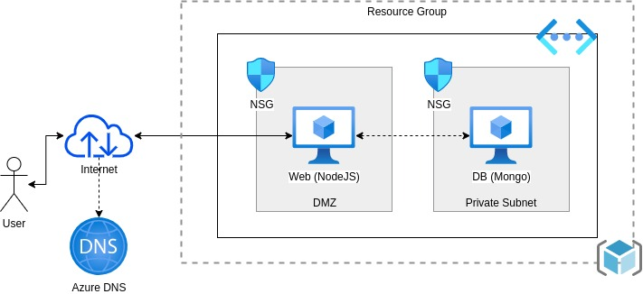
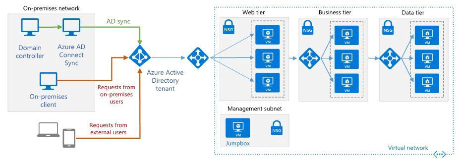

Assignment-I
============

Deploy <https://github.com/scotch-io/node-todo> on Azure VMs

This node-todo application has two components – node application and
MongoDB for backend. Deploy node applications on one VM and MongoDB on
another. Following is the deployment architecture

From this, you should be understanding and answerable to following

1.  What is DMZ, how to restrict the web service access to limited
    networks
2.  How standard web & DB systems (two-tier) get deployed. What are the
    best practices that followed in setting up the two-tier application
    on azure
3.  How Azure DNS works, how to configure it and access web service
    using DNS name
4.  How to troubleshoot such application in case of issues like
    communication failure between web and DB, webserver not starting
5.  Setup Azure monitoring. Get & analyze VM insights, set up alerts on
    low memory/cpu, understand Azure monitor metrics
6.  Perform snapshot backups of Web and DB systems and recover the
    systems from the Backup snapshots. Understand best practices in
    setting up VM backups
7.  Understand the role of NSG and how it is different from
    Azure Firewall. You should clearly be stating which one to use and
    when (in what scenarios you will be going to use Azure firewalls)
8.  Suggest improvements in the above deployment architecture

Assignment-II
=============

This assignment involves understanding Azure active directory service
and its use-cases. Azure active directory is an enterprise identity
service that provides SSO and multi-factor authentication.

The general use case looks similar to shown below diagram.

You should be working on the following:

1.  Get introduce to Azure AD services, understands its use-cases,
    different types of authentication mechanism it supports.
2.  Understand procedure to register an application with Azure
    active directory. Refer:
    [https://docs.microsoft.com/en-azure/active-directory/](https://docs.microsoft.com/en-gb/azure/active-directory/develop/quickstart-register-app)
3.  Understand common deployment scenarios:
    https://docs.microsoft.com/en-us/azure/active-directory-domain-services/scenarios
4.  Understand scenarios like – provide access to self cloud account
    users; provide access to users from the different azure account;
    provide access to users outside of azure cloud services
5.  Deploy python flask application on a Azure VM and enable the
    application to sign in users through Azure AD service:

<!-- -->

Assignment-III
==============

Scenario:

 Customer want to establish site-to-site vpn between his azure SaaS VPC
to customer premise network

Objective:

 A) Understand how site-to-site VPN works

 B) Able to define and configure Azure site-to-site VPN

Task:

https://backupbits.wordpress.com/2019/03/27/creating-a-site-to-site-vpn-between-your-lab-azure/
